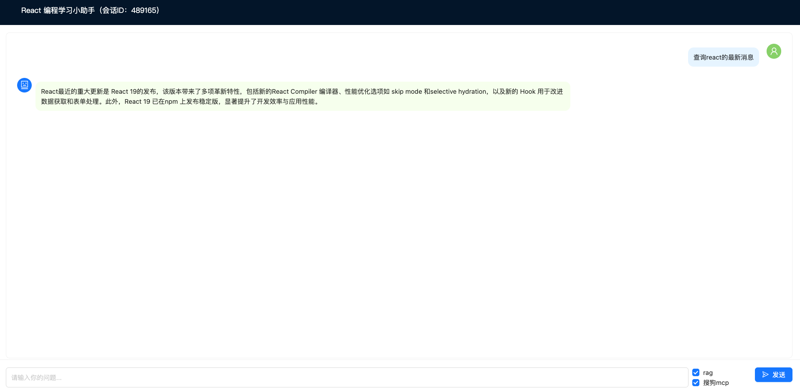

# 帮助学习React的Chat小助手

### 介绍

该项目是基于Spring AI开发的，部分用上Spring AI Alibaba技术（比如redis存储会话记忆从而维护多轮对话）。可以帮助用户学习React这一常见的前端框架。

前端上使用React和TypeScript搭建，其中，因为后端返回流式数据，所以此处采用EventSource方式发送输入内容和得到LLM生成的回复内容，更好地处理流式内容。

EventSource是浏览器接受ServerSent Events的API，可以让服务器主动推送消息给客户端，是单向通信，一般请求方式为GET。

而后端程序则是使用SpringBoot、Spring AI搭建，返回值采用Flux和SSE（ServerSentEvent）。

### 项目具备的功能(大部分实现在后端中，前端只是展示最终结果)：

1. 借助阿里云百炼大模型API，实现问答流程。
    - 使用该大模型的原因：
        - 给的免费额度多。
        - 其中的text-embedding-v4等可以用于配置向量模型。（把分割后的文本片段等向量化）
2. 引入会话记忆，让大模型开始具备记忆，更好维护多轮对话。
3. 配置会话记忆提供者对象，便于区分不同的会话对象。
4. 引入Redis，实现会话记忆的长期存储。
    - 使用Redis存储会话记忆的原因：
        - 和SpringBoot相比能够实现一定时间的外部存储。
        - 读取和存储速度很快，保证一定的性能。
    - 注意：此处使用Spring AI Alibaba实现。
5. 引入Redis-stack作为向量数据库。
6. 引入RAG，解决模型的幻觉问题。并且引入RRF-Fusion算法，更好优化RAG性能。
7. 引入搜狗MCP，实现工具的调用，能够查询最新消息，解决模型的实时性不够和幻觉问题。
8. 在后端系统中，引入RAG评估，更好调优模型。
9. 前端界面实现RAG和MCP的开启与关闭功能。

### 使用方式：

1. 下载程序

```
git clone git@github.com:liuweixu/ChatReact.git
```

2. 运行后端
   如果是IDEA，可直接打开然后运行ChatReactApplication.json

3. 运行前端

```
cd ChatReact/frontend
npm install
npm run dev
```

进入localhost:5173即可

### 注意：

- 需要APIKEY的有一个：阿里云百炼KEY，可以在yml文件中加入。另外需要在魔塔中查找[搜狗搜索mcp](https://modelscope.cn/mcp/servers/phoenixdna/kugou_search_v0.1)，申请相应的mcp。
- 使用embedding-model中，最好使用text-embedding-v3或v4（1024维），v2和v1版本存在redis存入数据维度不匹配的问题。
- embedding-model这个消耗比较快，注意用量。
- 如果有参考文件用于RAG，可以直接放在src/main/resources/docstest中（如果没有文件夹名就自己创建一个）。
- 在Spring AI上使用Redis-stack作为向量数据库时，database只能用0，用其他会出现不能正常读取的bug。
- 在Redis存储会话记忆上，使用的是Spring AI Alibaba的，Spring AI并没有支持。

### 界面示意图（Chat）


### 致谢

1. [Spring AI CSDN教程](https://blog.csdn.net/linwu_2006_2006/category_12993051.html)
2. [Spring AI官网](https://blog.csdn.net/linwu_2006_2006/category_12993051.html)
3. [Spring AI Alibaba官网](https://java2ai.com/)
4. [阿里云百炼大模型](https://bailian.console.aliyun.com/?accounttraceid=494cccbc11014cf1a6f54cba1bc77e68dsju#/model-market/all)
5. [魔塔社区](https://modelscope.cn/mcp)
6. [ChatGPT](https://chatgpt.com/)