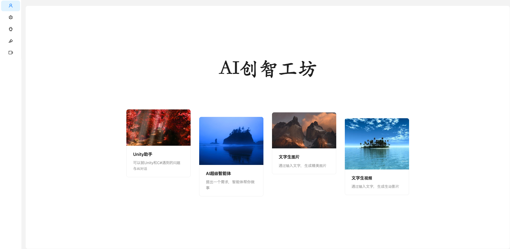
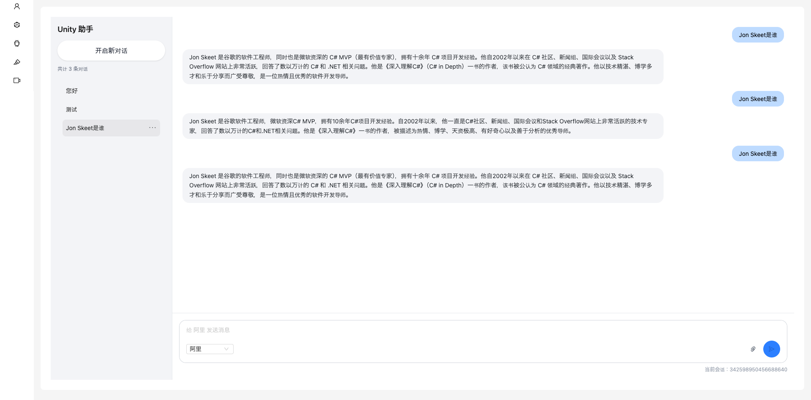
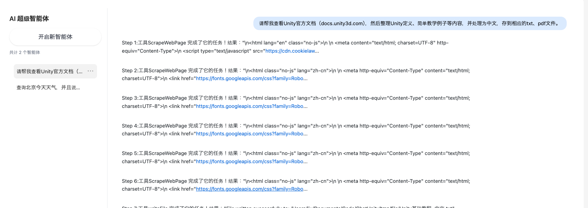
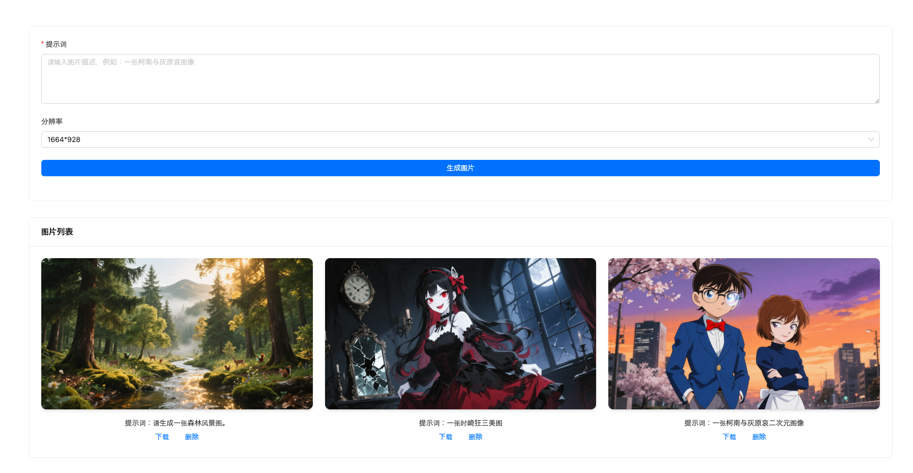
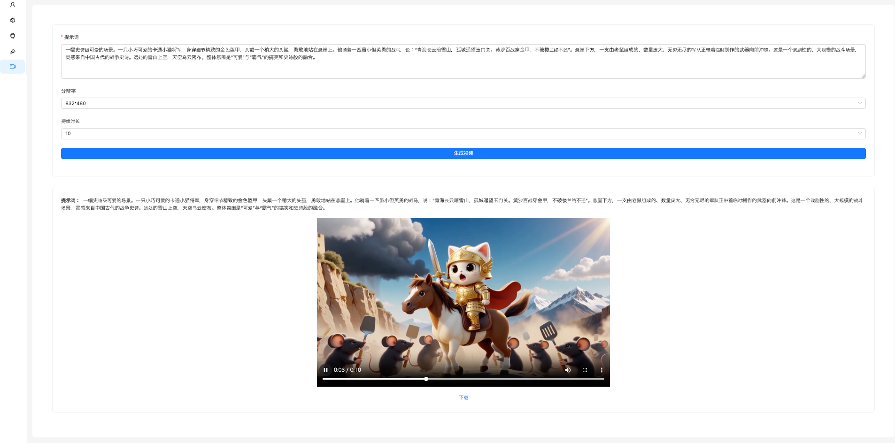

# AI创智工坊

## 项目介绍

基于Spring Boot3 + Spring AI/Spring AI Alibaba + RAG + 工具调用 + MCP的**多功能**
AI创智工坊，提供Unity助手、拥有自主规划能力的智能体、图片生成与视频生成四个模块。支持多轮对话、对话历史存储与查询、RAG知识库检索、工具调用等功能，智能体能够基于RaAct模式自主思考，并调用网页搜索与处理、PDF生成等工具完成复杂任务。

## 项目架构图（待定）

## 技术选型

### 后端

- Spring Boot3.6: 搭建后端系统。
- Spring AI（1.1.0-M2） 和 Spring AI Alibaba（1.0.0.4）：可集成在Spring系统上的AI框架。
- MyBatis-Flex：MyBatis的一种加强版本，能够支持批量查询、删除等操作。
- MySQL：对话历史持久化。
- Redis 和 Redis-Stack：作为高速数据库，用于会话记忆持久化，而Redis-Stack还可以作为向量数据库。
- Flux：实现AI生成内容的流式输出。
- Caffeine: 本地缓存优化。
- 腾讯云COS：对象存储

### 前端

- React 19 和 TypeScipt: 搭建前端系统。
- Ant Design：组件库。
- EventSource：用于对Flux流式输出内容处理。
- Cursor：用于Vibe Coding，生成一些比较难以处理的界面。

## 项目功能模块

### 首页

借助Ant Design的Card实现，图片使用随机图片源。

### Unity助手

界面风格参考ChatGPT和DeepSeek，系统提示词以Unity和C#学习为主，专门针对Unity学习辅助用。

通过输入文字可以得到AI回复，提供多个模型选择功能，并且可以管理多个对话，浏览对话历史等。

### AI超级智能体

该超级智能体属于通用智能体，基于ReAct思想实现，可以通过一系列提示词实现多轮思考-行动，让智能体自主处理任务，帮你做事，比如可以网页查询、下载文件等。

### 图片生成（基于文字）

可通过输入提示词，比如生成一张时崎狂三美图等，然后选择分辨率，从而可以生成相应的图片，并且提供下载功能。

本系统也提供对生成图像的持久化存储功能，生成图片结束后，会在图片列表展示生成图片。

### 视频生成（基于文字）

和图片生成模块类似，能够生成5秒或10秒的视频，提供下载功能。本系统也提供对生成视频的持久化存储功能。

